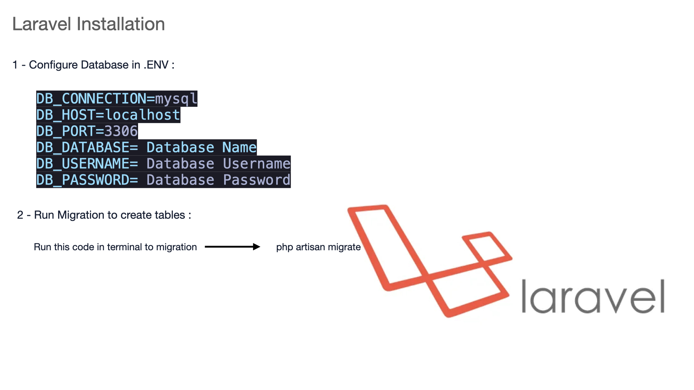

# Usage

## Python script
First you should install the pypi requirements and run the python classifier code:

```
pip install -r classify/requirements.txt
```

Then:

```
python classify/main.py
```

<br>

## Php laravel script
You can run the php code using this instruction:




